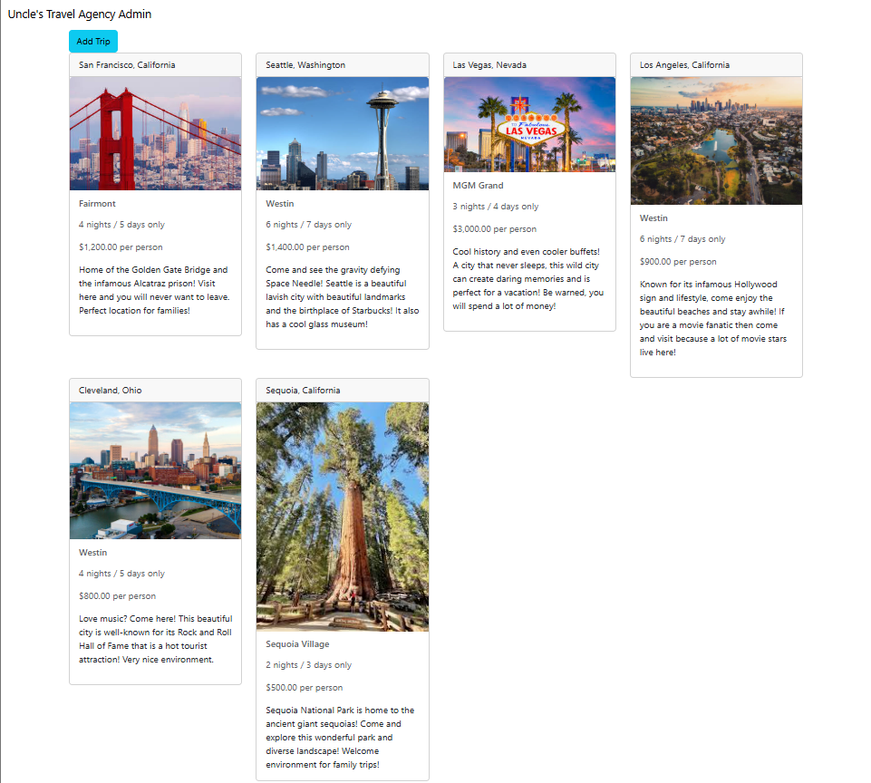

# SNHU CS 499 COMPUTER SCIENCE CAPSTONE

## ALYSSA LOMAS

## Professional Self-Assessment

My time during the Computer Science program exposed me to real-life scenarios where I was able to gain experience creating projects and meeting deadlines. While I was developing my ePortfolio I was able to reflect on my work and apply industry-best standards and methods to ensure I am showing my best work. Having to complete various projects throughout my time in the computer science program also gave me confidence in my ability to create, debug, enhance, and maintain projects especially given many different scenarios and projects assigned to me. For example, I have been exposed to various programming languages such as C++, Java, Python, Linux, JavaScript, Html, and CSS. I was also exposed to different programming environments ranging from Android Studio, where I was able to create an inventory app, or Sublime Text and Visual Studio Code where I was able to create a website. I have taken courses that have allowed me to see how a collaborative environment, such as one with a Scrum team, would interact with each other and work together to finish a project. I was also able to understand that everyone in a development team has separate yet collaborating responsibilities and a transparent relationship with the client and stakeholders. I have had courses where I was able to manipulate a database using structured database environments as well as creating a database for a full-stack application. I am skilled in creating HTML with CSS files and I have used JavaScript to link the backend database to the frontend UI pages to create a fully functional and aesthetic website. I can apply computer science techniques to many different applications using different programming languages and I have been able to create a secure login mechanism so that vulnerable data and information is protected from any malicious attacks.

## Code Review

Link To See My Code Review:
[Code Review](#https://youtu.be/7d6qp1DWgcM)

During the code review I am going to review my Java webpage project and show how I can render a client-side webpage using Object-Oriented Programming principles. I am going to demonstrate how I can also create a HTML website and how I am able to style the website using a Cascading Style Sheet. More specifically, I am going to focus on my language skills with both Java and HTML.

## Category One: Software Design and Engineering

LINK TO PAPER

To fulfill the five course outcomes as well as the three categories expected of me, I first started my enhancement plan with my static webpage developed with Java that displayed five vacation trips and a function where if the user clicked on one of the trips, then the cell would light up a magenta color. Each trip was equipped with a corresponding picture as well as a small description and the name of the photographer. I planned to enhance this artifact by completely translating the Java webpage into a website with five different webpages that acted as a typical website you would find for a travel agency. This covered the Software Engineering and Design category as well as the course outcome: Demonstrate an ability to use well-founded and innovative techniques, skills, and tools in computing practices for the purpose of implementing computer solutions that deliver value and accomplish industry-specific goals.

While pretending like I was a member of a Scrum team, I was enrolled in a course that prepared me to work effectively in a collaborative environment and this course forced me to understand the importance of working together with other team members. In my enhancement plan for my ePortfolio, I wanted to include my paper I wrote about the different roles and responsibilities of each member of a team and how successful and beneficial it can be to be a part of a team. I also prepared a code review that discerns my code and my plan for the rest of the artifacts and these pieces of work both cover the Software Engineering and Design category as well as the two course outcomes: Employ strategies for building collaborative environments that enable diverse audiences to support organizational decision-making in the field of computer science, and Design, develop, and deliver professional-quality oral, written, and visual communications that are coherent, technically sound, and appropriately adapted to specific audiences and contexts.  

## Category Two: Algorithms and Data Structures

Taking my HTML travel agency website, I planned on enhancing this further and turning it into a website using full-stack development. I developed a database where I added my previous vacation trips. I was able to create a data structure along with an added login screen that required the user to pass authentication measures to access functions only accessible if the user login information matched and was allowed access. This process allowed me to fulfil the Algorithms and Data Structures category as well as achieve the following course outcome: Develop a security mindset that anticipates adversarial exploits in software architecture and designs to expose potential vulnerabilities, mitigate design flaws, and ensure privacy and enhanced security of data and resources.

## Category Three:  Databases

I wanted to showcase my skills in manipulating the database I created for my travel agency webpage and show I can add logic to allow users to manipulate the trip elements by editing the information and by having the option to add an entirely new element all together. I was able to create buttons using HTML so the users could easily navigate this functionality, and I also made sure the backend database matched the updates made by the user. By taking my original Java webpage and turning into a complex webpage created with full stack development, I was able to expand the scope and add more functionality and value to my original artifact. With the newly added functionality, I was able to meet the requirements for the Databases category, and I also fulfilled the last outcome: Design and evaluate computing solutions that solve a given problem using algorithmic principles and computer science practices and standards appropriate to its solution while managing the trade-offs involved in design choices.  

# Original artifact 

Static Java Webpage that displays five different locations and has a feature that lights up the cell once a user clicks on a trip.

# Enhancement One: Software Design and Engineering

LINK TO NARRATIVE 

ADD LINK TO GIT HUB

This artifact shows the baseline of my software development skills and the beginning of my ability to render a webpage with the programming language Java. I am going to enhance this artifact by completely redeveloping it into a fully functional HTML website with a corresponding CSS file, then translate it into a different language. I am also going to use this artifact as the first step to creating a full stack website. Exclusively, this enhancement expands the scope of the original project and transforms it into a complex and functional website. This not only takes careful planning and design, but I also must use my previous knowledge to create a website using HTML and translate it into a different application. The skills I will demonstrate are my language skills as well as my skill in creating a markup website. 

# Enhancement Two: Algorithms and Data Structure

LINK TO NARRATIVE

ADD LINK TO GITHUB

This artifact is my product of the enhancement of my HTML website where I implemented full stack development principles and techniques. It originally was my static Java webpage, but I was able to change it and made it more dynamic. I expanded the complexity of not only the website itself, but also the complexity of the data structures. While transforming this simple website into a complex full stack program, I utilized MongoDB which helped me improve the data structure and expand the scope of what the website can handle. Not to mention I successfully implemented a user authentication login system that added needed security to the website. 

# Enhancement Three: Databases

Add Button Feature Before and After 

Edit Button Feature

LINK TO NARRATIVE

ADD LINK TO GITHUB

This artifact is my full-stack application where I added more functionality by adding features such as buttons that add and edit elements. For this enhancement my plan was to create a MongoDB interface while also using HTML, CSS, and JavaScript by building a full stack application. I was able to accomplish this plan, allowing me to demonstrate my experience with full stack development and my capability to manipulate a database.

## Course Outcome One: 

I employed strategies for building collaborative environments enabling diverse audiences through my artifact because I show a level of understanding from the different yet collaborating roles there are in a team. I also show that I understand the responsibilities and processes it takes from everyone to create a project in an organized manner. The course I have chosen my artifacts from also challenged me to write in a way that any audience would understand my explanations as well as my definitions, so I believe that shows I am able to cater to diverse audiences whether I am talking to my peers or someone who has no prior knowledge of technical terms.

## Course Outcome Two: 

I designed, developed and delivered professional quality oral, written, and visual communications through my code review and my narratives. Through my code review I was coherent and technically sound when discussing my code as well as my enhancement plans for each category and artifact. My narratives demonstrate my level of understanding when it comes to coherently communicating my decisions and experience when enhancing each artifact. 

## Course Outcome Three: 

I designed and evaluated computing solutions using algorithmic principles and computer science practices by demonstrating I can add functionality that manipulates a database by adding elements or editing them. I was able to use my knowledge of HTML so I could add buttons to initiate these functions in a practical way. 

## Course Outcome Four: 

I demonstrated an ability to use well-founded and innovative techniques, skills, and tools to accomplish an industry-specific by taking my original and basic Java program, transforming it into an HTML website, then into a full-stack application. The enhancements I performed show I have the necessary experience with different software environment tools, such as Visual Studio Code, Node.js, MongoDB, DBeaver, and Postman, and I also have the skills to be able to translate this basic project into a complex and technically sound full-stack application. 

## Course Outcome Five: 

I demonstrated a security mindset by developing a security protocol that is designed to protect vulnerabilities and ensure the security of data by implementing a login screen. This login screen regulates if a user can access the addition and edit functionality and if the user does not pass authentication, then the functions are not accessible. I utilized a feature called Salt that adds random data to a password and then used a hashing function to securely store passwords. 

Link to the helpful section: [Link Text](#thisll-be-a-helpful-section-about-the-greek-letter-Θ).

Link to the first non-unique section: [Link Text](#this-heading-is-not-unique-in-the-file).

Link to the second non-unique section: [Link Text](#this-heading-is-not-unique-in-the-file-1).
